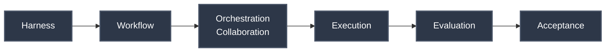

# Team Agents Cowork

**Team Agents Cowork** is a mature, open-source standard: **A Multi-Agent / Multi-AI Coding Collaboration Framework for Personal and Team Domains**. 

Unlike rigid interceptors or heavy IDE-bound plugins, this framework prioritizes **Low Cognitive Load** and **Low Invasiveness**. It relies on pluggable adapters and does not force IDE or Agent unification. We solely enforce the collaboration contract, state transitions, and acceptance criteria.

## 📖 Documentation Center / 文档中心

Please select your preferred language to enter the Documentation Center:
请选择您的语言进入文档中心：

- 🇬🇧 **[English Documentation Portal](documentation/EN/README.md)**
- 🇨🇳 **[中文文档中心](documentation/ZH/README.md)**

## The 6-Stage Multi-Agent Lifecycle

This framework structures multi-AI collaboration through a clear 6-stage lifecycle:

1. **Harness:** Setup and bootstrapping via pluggable adapters.
2. **Workflow:** Establishing the procedural steps and state machine.
3. **Orchestration/Collaboration:** Managing interactions between heterogeneous AI agents.
4. **Execution:** Code generation and manipulation.
5. **Evaluation:** Validating outputs against requirements.
6. **Acceptance:** Final gating based on strict acceptance criteria.

*Ready to transform your development workflow? Head to our [English Portal](documentation/EN/README.md) or [Chinese Portal](documentation/ZH/README.md).*
