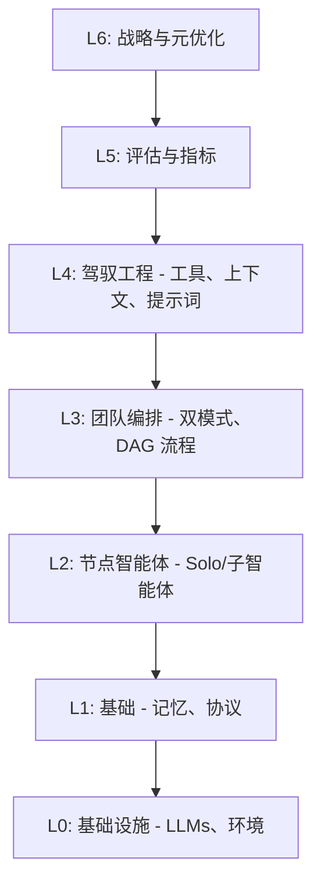
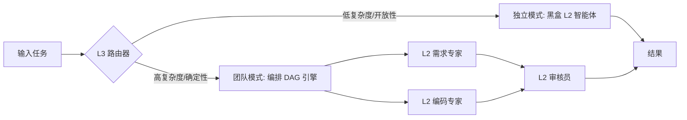

# Team Agents Cowork

## 项目定位 (Project Positioning)
**Team Agents Cowork** 是一个生产级的多智能体编排框架，专为可扩展、复杂的任务执行而设计。本项目立足于企业级应用场景，致力于通过高度自治的独立智能体 (Solo) 以及精心编排的团队集群 (Team)，实现高复杂任务的自动化分解与确定性执行。

## 背景 (Background)
随着大模型能力的跃升，传统的单一智能体已无法满足长链路、高复杂度与高确定性要求的业务场景。由于缺乏规范的隔离机制和编排能力，多智能体系统容易陷入混乱、上下文丢失及状态不可控的问题。基于此背景，Team Agents Cowork 引入了严格的模块化设计和抽象层机制，以工程化的方式驯服并发挥大模型的集群潜力。

## 理论范式 (Theoretical Paradigm - Harness Engineering L0-L6)
为了管理多智能体系统的复杂性，框架引入了严谨的 **L0-L6 驾驭工程 (Harness Engineering)** 分层架构。这确保了从底层模型调用到高层战略评估的清晰职责分离：

- **L0 基础设施**: 计算资源、基础大语言模型 (LLMs) 和运行环境。
- **L1 基础**: 状态管理、通信协议和跨节点记忆层。
- **L2 节点智能体**: 原子级的工作者，即能够独立运行、能力聚焦的高级子智能体 (Solo)。
- **L3 团队编排**: 框架的核心大脑。控制路由分发、任务 DAG 分解和智能体间的协作。
- **L4 驾驭工程**: 智能体的标准化接入控制。包含工具注册表、上下文边界与动态提示词注入矩阵。
- **L5 评估**: 内置指标监控、全链路追踪和自动化的质量保证 (QA)。
- **L6 战略**: 元学习、全局目标对齐与系统自进化。

## 架构 (Architecture)
通过严格的 L0-L6 分层机制确保职责分离和系统高可靠性：



## 主要功能 (Main Features)

### 1. 双模式编排 (Dual-Mode Orchestration)
**背景**: 不同的任务在探索性和确定性之间有不同的权衡要求。
**场景**: 简单的开放式问答、代码探索等适合黑盒独立执行；而复杂的软件研发流程、审核流水线则需要严格的图结构流程。
**定义**: 系统原生支持并可动态路由的两种任务编排模式：独立黑盒模式 (`blackbox`) 与编排团队模式 (`orchestrated`)。
**特性**:
- **独立模式 (Solo/Blackbox)**: 针对低结构化开销任务，将目标委托给高能力的单一智能体闭环执行。具有高探索性和低配置开销的优点。
- **团队模式 (Team/Orchestrated)**: 针对高确定性多步操作，将任务分解为有向无环图 (DAG)，每个节点由专业化智能体处理。支持并行执行、故障隔离和确定性校验。
**使用范例**:
- 独立模式：分析日志文件并找出错误根本原因。
- 团队模式：从需求分析 -> 架构设计 -> 代码开发 -> 测试审核的全链路开发流水线。



### 2. Solo/Team 工作区切换 (Solo/Team Workspace Switch)
**背景**: 开发者在本地环境调试和在集群环境执行时面临不同的状态管理需求。
**场景**: 本地调试时需要多并发共享上下文，而团队远程部署时需要绝对的任务隔离。
**定义**: 灵活的并发与状态隔离机制，支持在本地并发 (Local Concurrent) 与远程隔离 (Remote Isolated) 之间无缝切换。
**特性**:
- 一键切换 CLI 参数覆盖配置。
- 动态上下文隔离机制，防止状态污染。
**使用范例**:
```bash
# 团队远程隔离模式执行
npm run execute -- --workspace-mode=remote-isolated
```

### 3. 内置与自定义工作流 (Built-in/Custom Workflows)
**背景**: 快速上手与高度定制化的双重需求。
**场景**: 新用户开箱即用，高级用户深度定制。
**定义**: 提供 18 种生产级内置业务工作流模板，同时支持用户基于 YAML 语法编写并注入自定义的 DAG 工作流。
**特性**:
- 声明式的 YAML 语法描述 DAG。
- 热重载的自定义工作流注入矩阵。
**使用范例**:
调用内置的 API 开发工作流，或通过指定 `custom-workflow.yaml` 加载特有流水线。

## 快速开始 (Quick Start)

### 安装步骤
请确保您已安装 Node.js (v18+) 和 npm。

```bash
# 1. 克隆仓库
git clone https://github.com/your-org/team-agents-cowork.git
cd team-agents-cowork

# 2. 安装依赖
npm install

# 3. 初始化配置
npm run setup
```

### 可用命令与执行场景
```bash
# 执行独立模式探针测试
npm run start:solo -- --task="分析 data/logs.txt 发现异常"

# 运行团队编排工作流
npm run start:team -- --workflow=examples/basic-dag.yaml

# 启动并切换至远程隔离工作区模式
npm run start:team -- --workspace-mode=remote-isolated
```

## 场景 (Scenarios)
- **自动化软件工程**: 需求拆解、代码生成、自动化单元测试与代码审查。
- **深度数据分析**: 从数据抓取、清洗、特征提取到最终报告生成的全自动化流水线。
- **智能化运维 (AIOps)**: 日志异常检测、根因分析以及故障自动修复提案生成。
- **研究与知识图谱构建**: 海量文献检索、信息抽取、知识关联建立和观点总结。

## 使用范例 (Usage Examples)
**范例 1：使用自定义团队工作流构建微服务**
1. 编写 `microservice-dag.yaml`，定义架构师、后端开发和测试智能体的依赖关系。
2. 运行 `npm run start:team -- --workflow=microservice-dag.yaml`。
3. 系统自动分配任务，架构师完成接口设计后，并行触发后端开发，最后汇总至测试智能体验收。

**范例 2：利用 Solo 模式进行本地代码重构**
1. 切换至 `local-concurrent` 工作区模式。
2. 运行 `npm run start:solo -- --task="将 src/utils 下的模块重构为 TypeScript"`。
3. 智能体将在本地工作区直接进行代码读取、修改和类型检查，快速返回结果。

---
> 欲了解更深度的 Archon 级别机制说明，请查阅 `documentation/ZH/` 目录下的相关白皮书和核心概念。