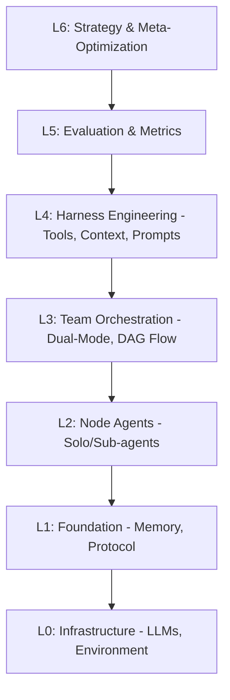
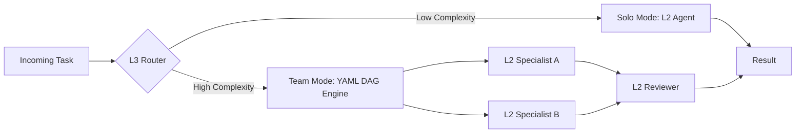

# Team Agents Cowork

Welcome to **Team Agents Cowork** — a production-grade, multi-agent orchestration framework designed for scalable, complex task execution. Built on the principles of **Harness Engineering** and a rigorous **L0-L6 Layered Architecture**, this framework empowers developers to deploy both highly autonomous solo agents and meticulously orchestrated team cohorts.

## 🌟 Core Philosophy: Harness Engineering & Layered Architecture

To manage the complexity of multi-agent systems, Team Agents Cowork introduces a strict **L0-L6 Layered Architecture**. This ensures separation of concerns, from raw model calls to high-level strategic evaluation.



- **L0 Infrastructure**: Compute, foundational LLMs, and runtime environments.
- **L1 Foundation**: State management, communication protocols, and memory layers.
- **L2 Node Agents**: The atomic workers. Highly capable sub-agents that can operate independently.
- **L3 Team Orchestration**: The heart of the framework. Controls routing, task decomposition, and inter-agent collaboration.
- **L4 Harness Engineering**: The standardized interface for agents. Tool registries, context bounds, and prompt injection matrices.
- **L5 Evaluation**: Built-in metrics, tracing, and automated quality assurance.
- **L6 Strategy**: Meta-learning and overarching goal alignment.

## 🚀 Dual-Mode Orchestration

Team Agents Cowork natively supports **Dual-Mode Orchestration**, allowing you to dynamically route tasks based on complexity and required determinism.

### Solo Mode (Blackbox Routing)
For tasks requiring high autonomy and minimal structural overhead, **Solo Mode** delegates the entire objective to a highly capable L2 Node Agent. The agent acts as a blackbox, independently reasoning, calling tools, and returning the final output. Ideal for exploratory analysis and open-ended queries.

### Team Mode (Orchestrated Routing)
For complex, multi-step operations requiring strict guardrails, **Team Mode** breaks down the objective into a Directed Acyclic Graph (DAG) of tasks. Each node in the DAG is handled by specialized L2 agents managed by the L3 Orchestrator. This ensures determinism, fault isolation, and parallel execution.



## 📚 Documentation

Dive deep into our comprehensive, Archon-level documentation to master the framework.

### Core Concepts
- [Dual-Track Gating](documentation/EN/core-concepts/dual-track-gating.md): Deep dive into Solo vs Team mode and dynamic routing.
- [YAML DAG Engine](documentation/EN/core-concepts/yaml-dag-engine.md): Understand the deterministic task orchestration syntax.

### Guides
- [Authoring Workflows](documentation/EN/guides/authoring-workflows.md): A step-by-step tutorial on building your first L3 Orchestrated Team.

## ⚙️ Quick Start

Ensure you have Node.js and npm installed.

```bash
# Clone the repository
git clone https://github.com/your-org/team-agents-cowork.git
cd team-agents-cowork

# Install dependencies
npm install

# Run a sample Team Mode workflow
npm run start:team --workflow=examples/basic-dag.yaml
```

## 🤝 Contributing

We welcome contributions to all layers of the L0-L6 architecture. Please review our `CONTRIBUTING.md` for PR guidelines, testing requirements, and code standards.

## 📘 Documentation Center (Archon-Level)

We have completely overhauled our documentation to be **Chinese-first** to accelerate team onboarding.
Please refer to the following definitive guides:

- **[内置工作流全景图 (18 Built-in Workflows)](./documentation/ZH/reference/built-in-workflows.md)**: Deep dive into all 18 templates, their Mermaid flowcharts, and trigger conditions.
- **[自定义工作流实战 (Authoring Custom Workflows)](./documentation/ZH/guides/authoring-workflows.md)**: Master the Dual-Mode Orchestration (`blackbox` vs `orchestrated`) and learn when/how to inject custom DAGs.
- **[系统治理协议 (Governance Protocols)](./documentation/ZH/core-concepts/governance-protocols.md)**: Understand L2/L3 separation and L0-L6 Harness Engineering.

> *Note: For English documentation, please refer to the `documentation/EN/` directory, though the `ZH` directory serves as the most comprehensive starting point for internal teams.*
