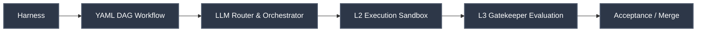

# Team Agents Cowork

**Team Agents Cowork** is a mature, open-source standard: **A Multi-Agent / Multi-AI Coding Collaboration Framework for Personal and Team Domains**. 

Unlike rigid interceptors or heavy IDE-bound plugins, this framework prioritizes **Low Cognitive Load** and **Low Invasiveness**. It relies on a powerful **YAML DAG Engine** and pluggable adapters, never forcing IDE or Agent unification.

## The Conceptual Triumvirate

To achieve this, the framework is built upon three foundational pillars:
1. **The Intent (Contract):** An `execution-contract.json` that defines mathematical boundaries.
2. **The Flow (YAML DAG):** Custom `.yaml` files orchestrating dependencies and routing.
3. **The Governance (Isolation):** Strict physical isolation of Executors (L2) and Gatekeepers (L3).

## 📖 Documentation Center / 文档中心

Please select your preferred language to enter our GitBook-style Documentation Portal:
请选择您的语言进入文档中心：

- 🇬🇧 **[English Documentation Portal](documentation/EN/README.md)**
- 🇨🇳 **[中文文档中心](documentation/ZH/README.md)**

## The 17 Built-in Workflows (Powered by LLM Router)

Our engine ships with 17 built-in, Archon-grade workflows. Simply describe your intent, and the LLM Router dynamically executes the perfect pipeline:

| Workflow | Description |
|---|---|
| `assist` | General Q&A, debugging, exploration |
| `fix-github-issue` | Classify issue → plan → implement → validate → PR → smart review |
| `idea-to-pr` | Feature idea → plan → implement → validate → PR → 5 parallel reviews |
| `plan-to-pr` | Execute existing plan → implement → validate → PR → review |
| `architect` | Architectural sweep, complexity reduction, codebase health |
| *(and 12 more...)* | See the Documentation Portal for the full catalog |

## Architecture: L2/L3 Dual-Track Gating

We enforce strict governance. AI Executors (L2) are mathematically barred from approving their own work. All intents and implementations must pass through isolated Gatekeepers (L3).

