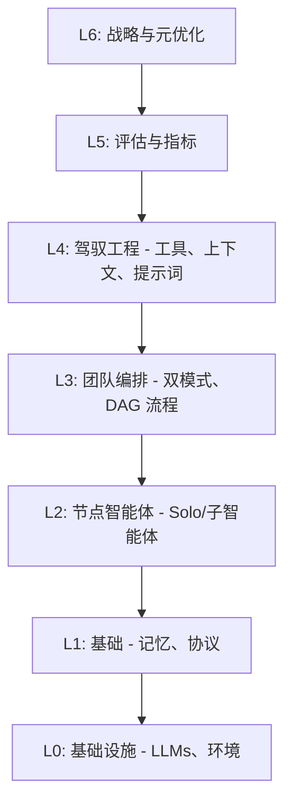
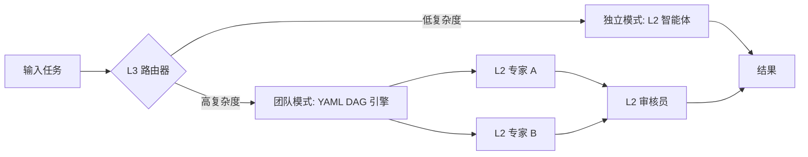

# Team Agents Cowork

欢迎使用 **Team Agents Cowork** —— 一个生产级的多智能体编排框架，专为可扩展、复杂的任务执行而设计。基于 **Harness Engineering (驾驭工程)** 原则和严谨的 **L0-L6 分层架构**，本框架使开发者能够部署高度自治的独立智能体 (Solo) 以及精心编排的团队集群 (Team)。

## 🌟 核心理念：驾驭工程与分层架构

为了管理多智能体系统的复杂性，Team Agents Cowork 引入了严格的 **L0-L6 分层架构**。这确保了从底层模型调用到高层战略评估的职责分离。



- **L0 基础设施**: 计算资源、基础大语言模型 (LLMs) 和运行环境。
- **L1 基础**: 状态管理、通信协议和记忆层。
- **L2 节点智能体**: 原子级的工作者。能够独立运行的高能力子智能体。
- **L3 团队编排**: 框架的核心。控制路由、任务分解和智能体间的协作。
- **L4 驾驭工程**: 智能体的标准化接口。工具注册表、上下文边界和提示词注入矩阵。
- **L5 评估**: 内置指标、追踪和自动化的质量保证。
- **L6 战略**: 元学习和全局目标对齐。

## 🚀 双模式编排 (Dual-Mode Orchestration)

Team Agents Cowork 原生支持 **双模式编排**，允许您根据任务的复杂度和所需的确定性动态路由任务。

### 独立模式 (Solo Mode - 黑盒路由)
对于需要高度自治且结构化开销最小的任务，**独立模式**将整个目标委托给一个高能力的 L2 节点智能体。智能体作为一个黑盒运作，独立进行推理、调用工具并返回最终输出。非常适合探索性分析和开放式查询。

### 团队模式 (Team Mode - 编排路由)
对于需要严格护栏的复杂多步操作，**团队模式**将目标分解为任务的图（有向无环图，DAG）。DAG 中的每个节点由专门的 L2 智能体处理，并由 L3 编排器管理。这确保了确定性、故障隔离和并行执行。



## 📚 文档

深入阅读我们 Archon 级别的详尽文档，以精通本框架。

### 核心概念
- [双轨网关 (Dual-Track Gating)](documentation/ZH/core-concepts/dual-track-gating.md): 深入探讨 Solo 与 Team 模式及动态路由。
- [YAML DAG 引擎 (YAML DAG Engine)](documentation/ZH/core-concepts/yaml-dag-engine.md): 了解确定性任务编排语法。

### 指南
- [编写工作流 (Authoring Workflows)](documentation/ZH/guides/authoring-workflows.md): 构建第一个 L3 编排团队的逐步教程。

## ⚙️ 快速开始

请确保您已安装 Node.js 和 npm。

```bash
# 克隆仓库
git clone https://github.com/your-org/team-agents-cowork.git
cd team-agents-cowork

# 安装依赖
npm install

# 运行示例团队模式工作流
npm run start:team --workflow=examples/basic-dag.yaml
```

## 🤝 贡献

我们欢迎对 L0-L6 架构的所有层级进行贡献。请查阅我们的 `CONTRIBUTING.md` 以获取 PR 指南、测试要求和代码标准。