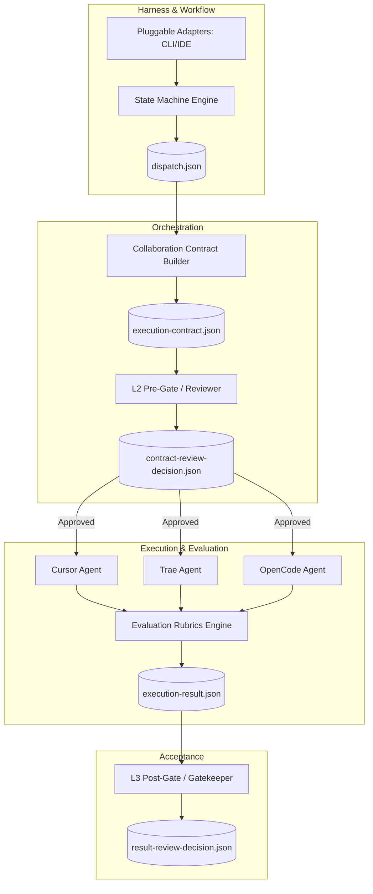

# Architecture: A Multi-Agent Collaboration Framework

The **Team Agents Cowork** architecture moves beyond legacy interceptor patterns, positioning itself as a comprehensive **Multi-Agent / Multi-AI Coding Collaboration Framework**. 

## The 6-Stage Multi-Agent Architecture

The architecture enforces a decoupled, stateless orchestration model. State is managed via explicit JSON artifacts, ensuring interoperability across tools.

## Core Design Principles

1. **Low Cognitive Load:** The architecture abstracts away the friction of synchronizing disparate AI tools. You only need to define the collaboration contract.
2. **Low Invasiveness:** We do not force IDE unification. Whether a team member uses Cursor, OpenCode, or Trae, the framework integrates seamlessly via **pluggable adapters**.
3. **Stateless Governance Engine:** `team-agents-cowork` operates as a stateless engine. State is abstracted to a local `.agent-state/` folder within the target repository.
4. **Contract Enforcement over Code Interference:** We enforce *how* the state transitions and verify *acceptance criteria*, rather than strictly monitoring the Git diff character-by-character.

## Deep Dive: State Machine & Dual-Track Gating

The architectural backbone relies on separating Intent (Orchestration) from Execution. This is achieved via Dual-Track Gating.

### The L2 Pre-Gate (Intent Validation)
Before any physical file is modified, the Orchestrator generates an `execution-contract.json`. The L2 Gate asynchronously validates:
- **File Access Matrix:** Are the `allowed_files` disjoint from other executing agents?
- **Dependency Graphs:** Are prerequisite tasks completed?
- **Scope Creep:** Does the proposed implementation plan match the `dispatch.json` goals?

> **Note:** If L2 validation fails, the contract is sent back to the Orchestrator for revision. The AI Agents remain idle until approval is granted.

### The L3 Post-Gate (Execution Validation)
Once an Agent finishes coding, it produces an `execution-result.json`. The L3 Gate enforces the Acceptance Criteria:
- **Diff Constraints:** Did the agent only modify files within its `allowed_files`?
- **Test Integrity:** Did the specified tests pass?
- **Static Analysis:** Were there any critical linting or formatting regressions?

By strictly bounding the problem space at L2 and ruthlessly verifying it at L3, the architecture allows heterogenous agents to work in parallel without state collision.
