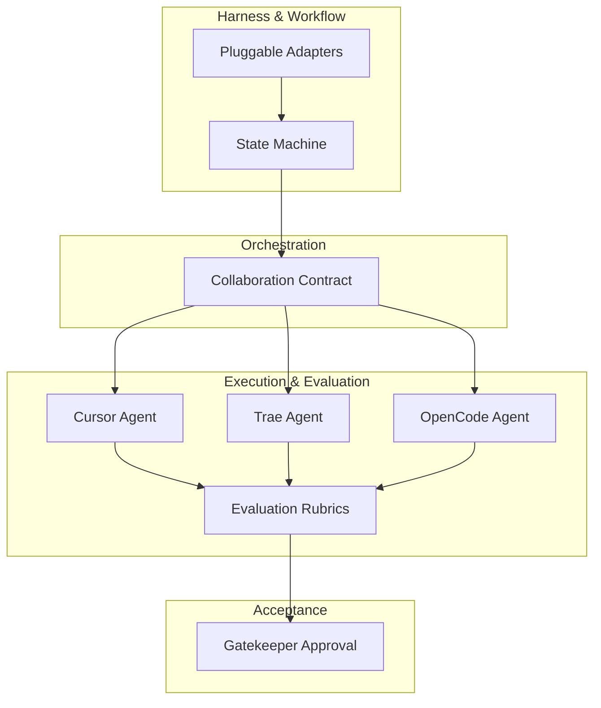

# Architecture: A Multi-Agent Collaboration Framework

The **Team Agents Cowork** architecture moves beyond legacy interceptor patterns, positioning itself as a comprehensive **Multi-Agent / Multi-AI Coding Collaboration Framework**. 

## The 6-Stage Multi-Agent Architecture

## Core Design Principles

1. **Low Cognitive Load:** The architecture abstracts away the friction of synchronizing disparate AI tools. You only need to define the collaboration contract.
2. **Low Invasiveness:** We do not force IDE unification. Whether a team member uses Cursor, OpenCode, or Trae, the framework integrates seamlessly via **pluggable adapters**.
3. **Stateless Governance Engine:** `team-agents-cowork` operates as a stateless engine. State is abstracted to a local `.agent-state/` folder within the target repository.
4. **Contract Enforcement over Code Interference:** We enforce *how* the state transitions and verify *acceptance criteria*, rather than strictly monitoring the Git diff character-by-character.
