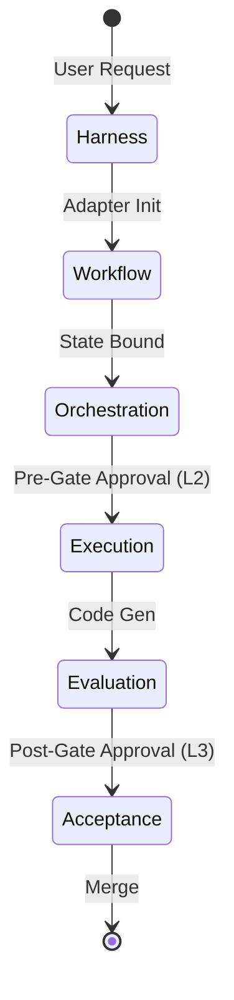
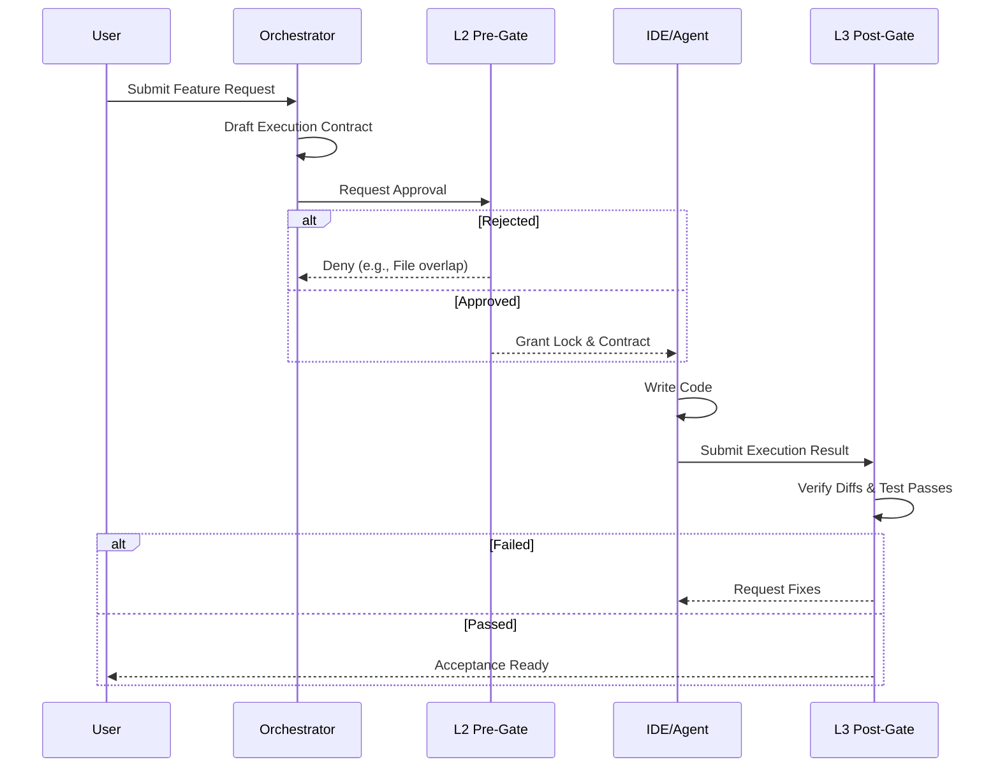

# Core Concepts & Overview

**Team Agents Cowork** is a mature **Multi-Agent / Multi-AI Coding Collaboration Framework**. It structures your personal and team development domains into an orchestrated workspace where heterogeneous AI tools (like Cursor, OpenCode, and Trae) collaborate efficiently and safely.

## What Problem Does It Solve?

Modern development relies heavily on AI coding environments. However, scaling AI introduces friction:
1. **Tool Silos & IDE Lock-in:** Forcing teams into a single IDE limits productivity.
2. **State Collision:** Multiple AI agents operating simultaneously overwrite or conflict with each other's work.
3. **High Cognitive Load:** Manually orchestrating multiple AI contexts and reviewing endless chat histories is unsustainable.

## The Solution: A 6-Stage Lifecycle

We enforce a structured, non-invasive **6-Stage Lifecycle** that guarantees code quality while maintaining Low Cognitive Load:

1. **Harness**: The entry point where user intents are captured via pluggable adapters (e.g., CLI, IDE plugins).
2. **Workflow**: The intent is normalized into the internal State Machine.
3. **Orchestration/Collaboration**: Work is divided into isolated tasks; Execution Contracts are drafted.
4. **Execution**: The assigned Agent (Cursor, Trae, etc.) implements the code.
5. **Evaluation**: Code is statically and dynamically checked against the Evaluation Rubrics.
6. **Acceptance**: Final gating before code is accepted into the main branch.

> **Warning:** Do not bypass the 6-stage lifecycle manually. Bypassing stages will cause state divergence between the local workspace and the orchestration engine.

## Core Constraints

Rather than acting as a rigid L2/L3 interceptor or manipulating Git diffs manually, we rely on three core pillars:

1. **Low Cognitive Load:** Abstraction of inter-agent communication. Human developers focus on the big picture.
2. **Low Invasiveness:** **Pluggable adapters** mean there is no forced IDE or Agent unification. Use the tools you prefer.
3. **Contract Enforcement:** We strictly govern the **Collaboration Contract**, state transitions, and **Acceptance Criteria**. AI agents are free to execute creatively, but they must clear the evaluation rubrics and acceptance gates.

## The State Machine & L2/L3 Dual-Track Gating

At the core of the framework is a deterministic State Machine coupled with an L2/L3 Dual-Track Gating system:

- **L2 (Pre-Gate):** Ensures the `execution-contract.json` is sound, non-overlapping, and secure *before* any code is written. It acts as an isolation boundary.
- **L3 (Post-Gate):** Verifies the actual implementation (`execution-result.json`) matches the exact constraints of the L2 contract (e.g., touched only allowed files, passed specific test commands).

## 5-Artifact Taxonomy

We track progress via clear JSON artifacts within the repository state (`.agent-state/` folder):

1. `workflow/dispatch.json`
   - **Purpose:** Harness & Workflow State.
   - **Contents:** The overall epic/task definition, assigned sub-agents, and global state machine status.
2. `*-execution-contract.json`
   - **Purpose:** Orchestration Intent.
   - **Contents:** Detailed step-by-step plan, `allowed_files` arrays, requested permissions, and dependency mappings.
3. `*-contract-review-decision.json`
   - **Purpose:** Collaboration Pre-Gate (L2).
   - **Contents:** The formal approval/rejection boolean, feedback strings, and signature of the gatekeeper agent.
4. `*-execution-result.json`
   - **Purpose:** Execution Evidence.
   - **Contents:** Summary of changes, actual files modified, unit test outputs, and time taken.
5. `*-result-review-decision.json`
   - **Purpose:** Acceptance Post-Gate (L3).
   - **Contents:** Final evaluation score, boolean acceptance flag, and merge authorization token.
