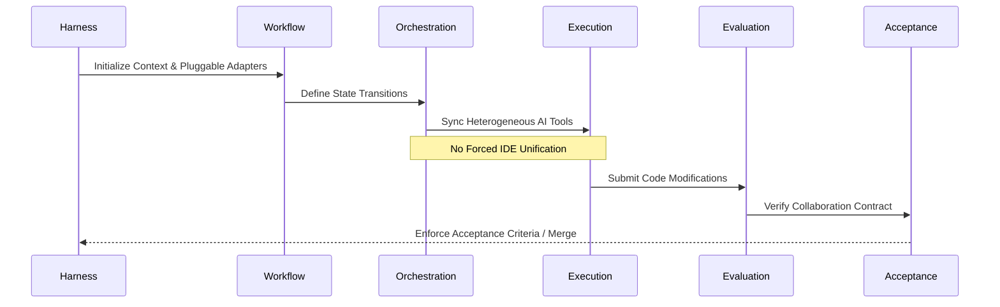

# Team Agents Cowork: English Documentation Portal

Welcome to the **Team Agents Cowork** documentation center.

**Positioning:** A Multi-Agent / Multi-AI Coding Collaboration Framework for Personal and Team Domains.

## Core Philosophy

Our framework is built on two primary constraints:
1. **Low Cognitive Load:** Minimizing the manual overhead required to manage multiple AI tools.
2. **Low Invasiveness:** Utilizing pluggable adapters rather than forcing unified IDEs or specific agents. 

We do not dictate how your AI writes code; rather, **we only enforce the collaboration contract, state transitions, and acceptance criteria.**

## The 6-Stage Lifecycle

Team Agents Cowork standardizes AI collaboration through a true 6-stage lifecycle:

### Lifecycle Breakdown

| Stage | Description | Key Enforcements & Features |
|-------|-------------|-----------------------------|
| **1. Harness** | Bootstraps the environment and connects repositories via pluggable adapters. | Zero lock-in; low invasiveness. |
| **2. Workflow** | Defines step-by-step processes for the specific task or sprint. | State transitions and routing. |
| **3. Orchestration & Collaboration** | Coordinates multiple AI agents (e.g., Cursor, OpenCode, Trae). | Collaboration contract enforcement. |
| **4. Execution** | AI agents perform actual code writing and edits independently. | Native tool utilization. |
| **5. Evaluation** | Checks code against standards, metrics, and test suites. | Automated feedback loops. |
| **6. Acceptance** | Final gating and approval before merging code into the main branch. | Strict acceptance criteria validated. |

## Quick Links

- [Overview & Core Concepts](./CORE_CONCEPTS.md)
- [Quick Start](./QUICKSTART.md)
- [Usage Guide](./USAGE.md)
- [Architecture Details](./ARCHITECTURE.md)
- [Team Collaboration](./TEAM_COLLABORATION.md)
- [AI Integration Guide](./AI_INTEGRATION_GUIDE.md)
- [Extension Guide (Custom Adapters)](./EXTENSION_GUIDE.md)
- [Governance & Workflow](./GOVERNANCE.md)
- [Native Capabilities Assessment](./NATIVE_CAPABILITIES_ASSESSMENT.md)
- [MCP API Reference](./MCP_API_REFERENCE.md)
- [Schema Reference](./SCHEMA_REFERENCE.md)
- [System Prompt](./SYSTEM_PROMPT.md)
- [Samples](./SAMPLES.md)
- [FAQ & Troubleshooting](./FAQ_TROUBLESHOOTING.md)

*Looking for the Chinese documentation?* [中文文档](../ZH/README.md)
