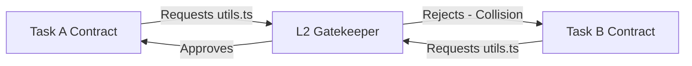

# Team Collaboration

In Team Mode, the protocol acts as a strict synchronization mechanism. It moves beyond single-user orchestration, enabling a whole team (humans and multiple AI tools) to work on the same repository safely.

## Capability Modeling & Task Distribution

A dedicated Orchestrator Agent reads the project's root objectives (e.g., a Jira Epic) and generates multiple bounded JSON contracts.

1. **Environment Querying:** The Orchestrator surveys available team resources (Alice using Trae, Bob using Cursor, CI/CD pipeline bots).
2. **Task Slicing:** 
   - Task A (Frontend UI) is assigned to Alice (Trae user).
   - Task B (Long-running database migrations) is assigned to an autonomous OpenCode daemon.
3. **Contract Dispatch:** Contracts are pushed to the central repository branch, pulling down via git syncs.

### Example Contract Payload

```json
{
  "task_id": "epic-402-frontend",
  "assignee": "alice-trae-agent",
  "dependencies": ["epic-402-api-schema"],
  "allowed_files": [
    "src/components/UserDashboard.tsx",
    "src/styles/dashboard.css"
  ],
  "forbidden_files": [
    "src/api/schema.ts"
  ]
}
```

## Conflict Resolution & Mathematical Isolation

Because every task has a strictly verified `allowed_files` boundary approved at the **L2 Pre-Gate**, parallel execution is mathematically guaranteed not to result in overlapping physical file mutations.

### How It Works

1. **Contract Overlap Check:** If Task A requests `src/utils.ts` and Task B requests `src/utils.ts`, the L2 Gate immediately rejects the latter contract.
2. **Refactoring via Delegation:** If Task B *needs* `src/utils.ts` changed, the Orchestrator forces Task B to depend on a new, separate Task C that explicitly refactors `src/utils.ts`. 



> **Warning:** To maintain this isolation, team members must pull the latest `.agent-state/` contracts before initiating their local AI execution loops.

## The "Agent Sync" Protocol (Dual-Tiered Workspace)

In a fully distributed team involving remote members, the `team-agents-cowork` framework utilizes a **Dual-Tiered Sync Topology** to coordinate without race conditions.

### The Problem with Real-Time State
If every developer's local AI pushed micro-state transitions (`contract_review_pending` -> `execution_ready` -> `result_review_pending`) to the main branch, the GitHub commit history would become an unreadable, noisy mess of trial-and-error logging, frequently causing merge conflicts.

### The Solution: Local Bus + Cloud Ledger

**1. The Cloud Ledger (GitHub `agent-sync` branch)**
- The Orchestrator (e.g., a Senior Developer or a dedicated Planner Agent) breaks down an Epic into multiple `execution-contract.json` files and commits them to the `.agent-state/tasks/` directory on a dedicated `agent-sync` branch.
- These tasks are unassigned (`"executor": null`).

**2. The Pull Model (Claiming Tasks)**
- Remote Developer Bob pulls the `agent-sync` branch.
- Bob's local AI (e.g., Cursor) reads the available contracts, finds one that matches its capabilities, updates the `executor` field to `bob-cursor`, and commits the claim locally.

**3. The Local Bus (The Execution Sandbox)**
- Bob's AI executes the task entirely on his local machine. 
- All intermediate trial-and-error states (`result_review_pending`, Gatekeeper rejections, self-repair loops via `git reset`) happen *exclusively on Bob's local `.agent-state/` bus*. They are never pushed to the remote repository.

**4. The Final Push (Acceptance)**
- Once Bob's local isolated Gatekeeper generates an `Approved` `decision.json`, Bob pushes the final, clean feature branch containing both the *source code changes* and the *Approved JSON artifacts* back to GitHub as a Pull Request.
- This guarantees that the remote team only sees validated intent and verified code, completely masking the noisy AI generation process.
