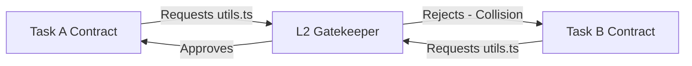

# Team Collaboration

In Team Mode, the protocol acts as a strict synchronization mechanism. It moves beyond single-user orchestration, enabling a whole team (humans and multiple AI tools) to work on the same repository safely.

## Capability Modeling & Task Distribution

A dedicated Orchestrator Agent reads the project's root objectives (e.g., a Jira Epic) and generates multiple bounded JSON contracts.

1. **Environment Querying:** The Orchestrator surveys available team resources (Alice using Trae, Bob using Cursor, CI/CD pipeline bots).
2. **Task Slicing:** 
   - Task A (Frontend UI) is assigned to Alice (Trae user).
   - Task B (Long-running database migrations) is assigned to an autonomous OpenCode daemon.
3. **Contract Dispatch:** Contracts are pushed to the central repository branch, pulling down via git syncs.

### Example Contract Payload

```json
{
  "task_id": "epic-402-frontend",
  "assignee": "alice-trae-agent",
  "dependencies": ["epic-402-api-schema"],
  "allowed_files": [
    "src/components/UserDashboard.tsx",
    "src/styles/dashboard.css"
  ],
  "forbidden_files": [
    "src/api/schema.ts"
  ]
}
```

## Conflict Resolution & Mathematical Isolation

Because every task has a strictly verified `allowed_files` boundary approved at the **L2 Pre-Gate**, parallel execution is mathematically guaranteed not to result in overlapping physical file mutations.

### How It Works

1. **Contract Overlap Check:** If Task A requests `src/utils.ts` and Task B requests `src/utils.ts`, the L2 Gate immediately rejects the latter contract.
2. **Refactoring via Delegation:** If Task B *needs* `src/utils.ts` changed, the Orchestrator forces Task B to depend on a new, separate Task C that explicitly refactors `src/utils.ts`. 



> **Warning:** To maintain this isolation, team members must pull the latest `.agent-state/` contracts before initiating their local AI execution loops.
