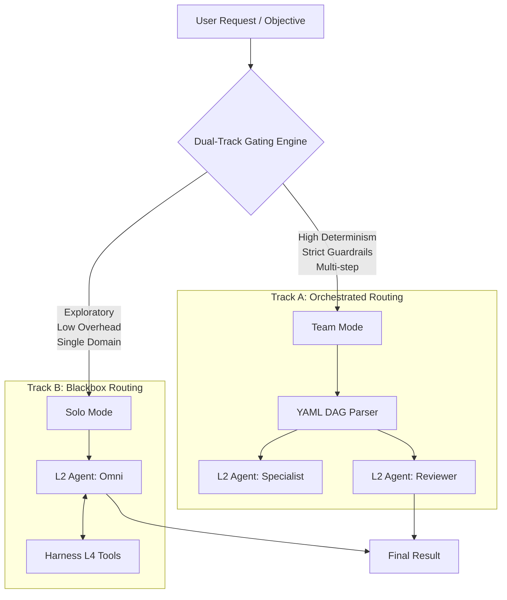

# Dual-Track Gating

At the core of the Team Agents Cowork framework is the **Dual-Track Gating** system. This L3 Orchestration component acts as an intelligent router, analyzing incoming objectives and deciding whether they are best served by a single, highly autonomous agent (Solo Mode) or a deterministically orchestrated team of agents (Team Mode).

## The Gating Philosophy

Not every task requires a team. Invoking a full YAML DAG for a simple query introduces unnecessary latency and overhead. Conversely, relying on a single agent to solve complex, multi-step engineering tasks often leads to context limit failures or hallucination loops.

The Dual-Track Gating system balances these extremes.



## Solo Mode (Blackbox Routing)

In **Solo Mode**, the objective is handed entirely to an L2 Node Agent. The L3 Orchestrator takes a step back and allows the agent to self-direct its path to the solution. 

### Characteristics
- **Autonomy**: High. The agent dynamically decides which tools to call and when.
- **Latency**: Low overhead. Direct invocation.
- **Best For**: Code summarization, single-API data fetching, exploratory queries.

### Harness Integration (L4)
Even in Solo Mode, the agent is bounded by **Harness Engineering**. It operates within a strictly defined sandbox, utilizing a predefined set of tools and context windows, preventing it from exceeding operational constraints.

## Team Mode (Orchestrated Routing)

In **Team Mode**, the L3 Orchestrator takes full control. The objective is mapped to a predefined or dynamically generated YAML DAG. The Orchestrator routes data between multiple L2 Node Agents, ensuring strict adherence to the execution graph.

### Characteristics
- **Determinism**: High. Execution flow is predictable and visible.
- **Fault Tolerance**: Isolated node execution. If Node A fails, Node B is not affected until the retry mechanism triggers.
- **Best For**: Complex software development, multi-stage data pipelines, comprehensive research requiring peer review.

### Cross-Layer Interaction (L2 <-> L3)
During Team Mode execution, L2 agents act purely as functional nodes. The L3 layer handles state persistence (via L1 protocols) and routes the output of one L2 agent directly into the context window (L4 Harness) of the next.

## Configuration

The gating mechanism can be statically forced or dynamically determined by an L6 Strategy model.

```yaml
# Example L3 Gating Configuration
router:
  mode: dynamic
  thresholds:
    complexity_score: 0.7
    requires_parallelism: true
  fallback: team
```