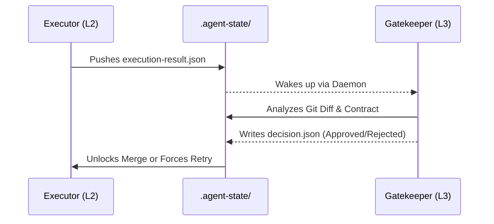

# L2/L3 Dual-Track Gating

To prevent "Agentic Sycophancy" (where an AI hallucinates success and approves its own flawed code), we mathematically isolate the Executor from the Reviewer.

> **Warning:** The Gatekeeper is a dedicated, isolated sub-process. It CANNOT be bypassed by the Executor.
