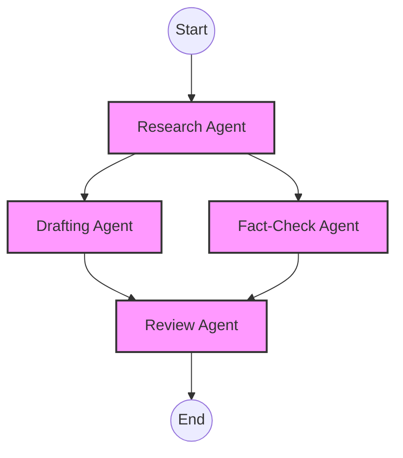

# YAML DAG Engine

In Team Mode, the L3 Orchestrator relies on the **YAML DAG Engine** to manage the execution flow. A Directed Acyclic Graph (DAG) provides a deterministic, transparent, and strictly ordered structure for complex task execution.

## Why YAML?

We chose YAML for authoring workflows because it is:
1. **Declarative**: Focus on *what* needs to be done, not *how*.
2. **Human-Readable**: Accessible to non-engineers, domain experts, and prompt engineers.
3. **Machine-Parseable**: Easily integrated with our L1 execution protocol and state management.

## Core Components of a DAG

A standard workflow consists of three primary blocks:

1. **Global Context**: Defines the shared state, initial inputs, and overarching goals.
2. **Nodes**: Represent L2 Agents assigned to specific tasks.
3. **Edges (Dependencies)**: Define the flow of execution and data injection between nodes.



## Schema Overview

Every node in the DAG must comply with the Harness Engineering (L4) specifications.

```yaml
version: "1.0"
name: "Article Generation Pipeline"

global_context:
  topic: "Quantum Computing Advances 2026"

nodes:
  - id: researcher
    agent_profile: "L2_DeepSearch"
    task: "Gather the top 5 recent breakthroughs in ${topic}."
    tools: ["search_api", "read_url"]
    
  - id: drafter
    agent_profile: "L2_TechnicalWriter"
    depends_on: ["researcher"]
    task: "Write a 500-word summary using data from the researcher."
    inject_context:
      - source_node: "researcher"
        target_variable: "research_data"
        
  - id: reviewer
    agent_profile: "L2_Critic"
    depends_on: ["drafter"]
    task: "Review the draft for technical accuracy."
    inject_context:
      - source_node: "drafter"
        target_variable: "draft_text"

output: "reviewer.final_output"
```

## Execution Semantics

- **Parallelism**: If nodes do not have intersecting `depends_on` arrays, the L3 Engine executes them concurrently.
- **Data Injection**: The `inject_context` block maps the output of a completed node into the prompt context of a downstream node.
- **Failure Handling**: If a node fails (e.g., L0 API timeout), the engine auto-retries based on the node's configuration before marking the graph as failed.