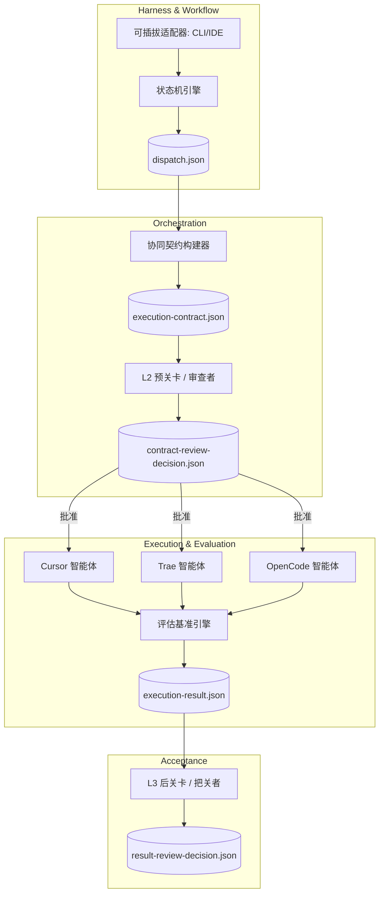

# 架构：一个多智能体协同框架

**Team Agents Cowork** 的架构超越了传统的拦截器模式，将自身定位为一个全面的 **多智能体 / 多AI编码协同框架**。

## 6阶段多智能体架构

该架构强制执行解耦的无状态编排模型。状态通过显式的 JSON 产物进行管理，从而确保跨工具的互操作性。

## 核心设计原则

1. **低认知负荷：** 架构抽象了同步各种 AI 工具所带来的摩擦。你只需定义协同契约。
2. **低侵入性：** 我们不强制要求 IDE 统一。无论团队成员使用的是 Cursor、OpenCode 还是 Trae，框架都可以通过 **可插拔适配器** 无缝集成。
3. **无状态治理引擎：** `team-agents-cowork` 作为无状态引擎运行。状态被抽象到目标代码库中本地的 `.agent-state/` 文件夹中。
4. **通过契约执行而非代码干预：** 我们强制规定状态*如何*转换，并验证*验收标准*，而不是逐字严格监控 Git diff。

## 深度剖析：状态机与双轨门控

该架构的骨干依赖于将 意图 (Orchestration) 与 执行 (Execution) 分离。这是通过双轨门控系统实现的。

### L2 预关卡 (意图验证)
在修改任何物理文件之前，编排器会生成一个 `execution-contract.json`。L2 关卡会异步验证：
- **文件访问矩阵：** `allowed_files` 是否与正在执行的其他智能体不相交？
- **依赖图：** 前置任务是否已完成？
- **范围蔓延：** 提议的实现计划是否与 `dispatch.json` 的目标相符？

> **注意：** 如果 L2 验证失败，契约会被退回给编排器进行修改。在获得批准之前，AI 智能体将保持空闲。

### L3 后关卡 (执行验证)
一旦智能体完成编码，它会生成一个 `execution-result.json`。L3 关卡会强制执行验收标准：
- **Diff 约束：** 智能体是否仅仅修改了其 `allowed_files` 范围内的文件？
- **测试完整性：** 指定的测试是否通过了？
- **静态分析：** 是否存在严重的 linting 错误或代码格式回退？

通过在 L2 严格限定问题空间并在 L3 进行无情验证，该架构允许异构智能体并行工作，同时避免状态冲突。
