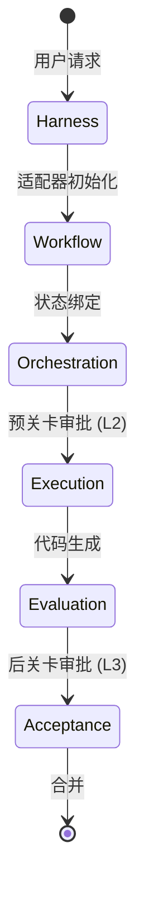
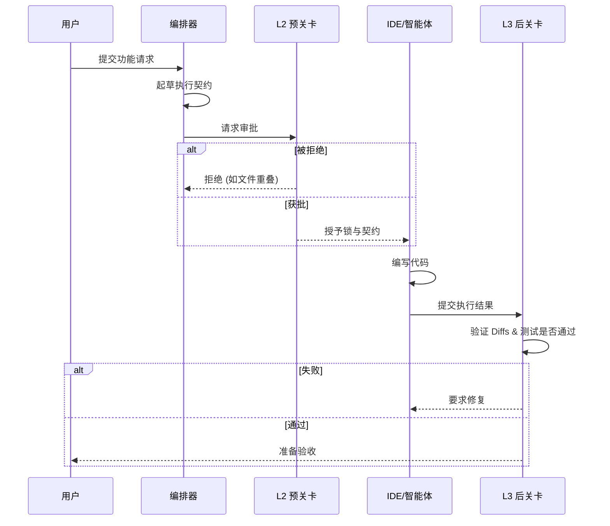

# 核心概念与概述

**Team Agents Cowork** 是一个成熟的 **多智能体 / 多AI编码协同框架**。它将个人和团队的开发领域结构化为一个协同工作区，在这里，异构的 AI 工具（如 Cursor、OpenCode 和 Trae）可以高效且安全地进行协作。

## 解决了什么问题？

现代开发越来越依赖 AI 编码环境。然而，扩展 AI 的使用会带来摩擦：
1. **工具孤岛与 IDE 锁定：** 强制团队使用单一的 IDE 会限制生产力。
2. **状态冲突：** 多个 AI 智能体同时操作可能会相互覆盖或产生代码冲突。
3. **高认知负荷：** 手动编排多个 AI 上下文并审查无尽的聊天记录是不可持续的。

## 解决方案：6阶段生命周期

我们强制执行一个结构化、非侵入式的 **6阶段生命周期**，在保持低认知负荷的同时保证代码质量：

1. **Harness（线束）**：通过可插拔适配器（如 CLI，IDE 插件）捕获用户意图的入口点。
2. **Workflow（工作流）**：将意图规范化为内部状态机。
3. **Orchestration/Collaboration（编排/协同）**：将工作划分为隔离的任务；起草执行契约。
4. **Execution（执行）**：分配的智能体（Cursor, Trae 等）实现代码。
5. **Evaluation（评估）**：根据评估基准对代码进行静态和动态检查。
6. **Acceptance（验收）**：代码被接受合并到主分支之前的最终把关。

> **警告：** 请勿手动绕过 6 阶段生命周期。跳过阶段将导致本地工作区和编排引擎之间的状态分歧。

## 核心约束

我们并不作为死板的 L2/L3 拦截器或手动操作 Git diff，而是依赖三大核心支柱：

1. **低认知负荷：** 抽象智能体间的通信。人类开发者只需关注全局。
2. **低侵入性：** **可插拔适配器** 意味着没有强制的 IDE 或智能体统一要求。使用你喜欢的工具即可。
3. **契约强制执行：** 我们严格管理 **协同契约**、状态转换和 **验收标准**。AI 智能体可以自由发挥创造力，但它们必须通过评估基准和验收关卡。

## 状态机与 L2/L3 双轨门控

框架的核心是一个确定性的状态机，辅以 L2/L3 双轨门控系统：

- **L2 (Pre-Gate/预关卡)：** 在任何代码被编写*之前*，确保 `execution-contract.json` 是合理的、无重叠且安全的。它充当隔离边界。
- **L3 (Post-Gate/后关卡)：** 验证实际的代码实现 (`execution-result.json`) 是否完全符合 L2 契约的约束（例如：只修改了允许的文件，通过了特定的测试命令）。

## 5大产物分类学

我们通过存储库状态（`.agent-state/` 文件夹）中清晰的 JSON 产物来追踪进度：

1. `workflow/dispatch.json`
   - **目的：** Harness 与 Workflow 状态。
   - **内容：** 整体史诗/任务定义，分配的子智能体以及全局状态机状态。
2. `*-execution-contract.json`
   - **目的：** 编排意图。
   - **内容：** 详细的步骤计划，`allowed_files` 数组，请求的权限和依赖映射。
3. `*-contract-review-decision.json`
   - **目的：** 协同预关卡 (L2)。
   - **内容：** 正式的批准/拒绝布尔值，反馈字符串以及把关智能体的签名。
4. `*-execution-result.json`
   - **目的：** 执行证据。
   - **内容：** 变更摘要，实际修改的文件，单元测试输出以及耗时。
5. `*-result-review-decision.json`
   - **目的：** 验收后关卡 (L3)。
   - **内容：** 最终评估分数，布尔值验收标志以及合并授权令牌。
