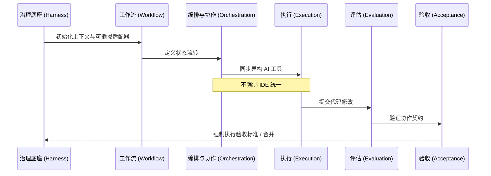

# Team Agents Cowork: 中文文档中心

欢迎来到 **Team Agents Cowork** 文档中心。

**项目定位:** 面向个人与团队领域的全栈多智能体 / 多 AI 编程协作框架 (A Multi-Agent / Multi-AI Coding Collaboration Framework for Personal and Team Domains)。

## 核心理念

本框架的构建基于两大核心约束：
1. **低认知负担 (Low Cognitive Load):** 最大限度地减少管理多个 AI 工具所需的人工开销。
2. **低侵入性 (Low Invasiveness):** 采用可插拔的适配器设计，不强制统一 IDE 或绑定特定的 Agent。

我们不干涉您的 AI 如何编写代码；相反，**我们仅强制执行协作契约 (Collaboration Contract)、状态流转 (State Transitions) 以及验收标准 (Acceptance Criteria)。**

## 六阶段生命周期

Team Agents Cowork 通过标准化的 6 阶段生命周期来构建多 AI 协作：

### 生命周期拆解

| 阶段 | 描述 | 关键约束与特性 |
|------|------|----------------|
| **1. 治理底座 (Harness)** | 通过可插拔的适配器启动环境并连接代码库。 | 零锁定；低侵入性。 |
| **2. 工作流 (Workflow)** | 为特定任务或冲刺定义步骤和流程。 | 明确状态流转与路由。 |
| **3. 编排与协作 (Orchestration/Collaboration)** | 协调多个 AI Agent（如 Cursor, OpenCode, Trae）。 | 强制执行协作契约。 |
| **4. 执行 (Execution)** | AI Agent 独立执行实际的代码编写和编辑。 | 利用原生工具链。 |
| **5. 评估 (Evaluation)** | 对照标准、指标和测试套件检查代码。 | 自动化反馈闭环。 |
| **6. 验收 (Acceptance)** | 在代码合并入主分支前进行最终的门禁和审批。 | 验证严格的验收标准。 |

## 快速链接

- [概览与核心概念](./CORE_CONCEPTS.md)
- [快速开始](./QUICKSTART.md)
- [使用指南](./USAGE.md)
- [架构说明](./ARCHITECTURE.md)
- [团队协作说明](./TEAM_COLLABORATION.md)
- [AI集成实施指南](./AI_INTEGRATION_GUIDE.md)
- [扩展开发指南 (自定义适配器)](./EXTENSION_GUIDE.md)
- [治理与工作流说明](./GOVERNANCE.md)
- [原生能力评估](./NATIVE_CAPABILITIES_ASSESSMENT.md)
- [常见问题](./FAQ_TROUBLESHOOTING.md)
- [示例](./SAMPLES.md)

*Looking for the English documentation?* [English Docs](../EN/README.md)
