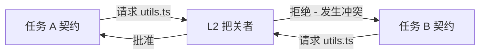

# 团队协作

在团队模式下，协议充当严格的同步机制。它超越了单用户编排，使得整个团队 (包含人类和多个 AI 工具) 能够安全地在同一个代码库上进行协作。

## 能力建模与任务分发

一个专用的编排器智能体会读取项目的根目标 (例如，一个 Jira 史诗) 并生成多个有边界的 JSON 契约。

1. **环境查询：** 编排器会调查可用的团队资源 (使用 Trae 的 Alice，使用 Cursor 的 Bob，CI/CD 管道机器人)。
2. **任务切分：** 
   - 任务 A (前端 UI) 被分配给 Alice (Trae 用户)。
   - 任务 B (耗时较长的数据库迁移) 被分配给一个自主运行的 OpenCode 守护进程。
3. **契约分发：** 契约会被推送到中央仓库分支，并通过 git 同步拉取到本地。

### 示例契约 Payload

```json
{
  "task_id": "epic-402-frontend",
  "assignee": "alice-trae-agent",
  "dependencies": ["epic-402-api-schema"],
  "allowed_files": [
    "src/components/UserDashboard.tsx",
    "src/styles/dashboard.css"
  ],
  "forbidden_files": [
    "src/api/schema.ts"
  ]
}
```

## 冲突解决与数学隔离

由于每个任务都有一个在 **L2 预关卡** 获得批准且经过严格验证的 `allowed_files` 边界，因此可以从数学上保证并行执行不会导致产生重叠的物理文件变更。

### 工作原理

1. **契约重叠检查：** 如果任务 A 请求修改 `src/utils.ts` 并且任务 B 也请求修改 `src/utils.ts`，L2 关卡会立即拒绝后者的契约。
2. **通过委托进行重构：** 如果任务 B *确实需要* 更改 `src/utils.ts`，编排器会强制任务 B 依赖于一个新的、独立的任务 C，而任务 C 的职责专门就是重构 `src/utils.ts`。



> **警告：** 为了保持这种隔离性，团队成员在启动本地 AI 执行循环之前，必须拉取最新的 `.agent-state/` 契约。
