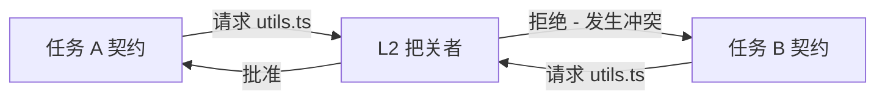

# 团队协作

在团队模式下，协议充当严格的同步机制。它超越了单用户编排，使得整个团队 (包含人类和多个 AI 工具) 能够安全地在同一个代码库上进行协作。

## 能力建模与任务分发

一个专用的编排器智能体会读取项目的根目标 (例如，一个 Jira 史诗) 并生成多个有边界的 JSON 契约。

1. **环境查询：** 编排器会调查可用的团队资源 (使用 Trae 的 Alice，使用 Cursor 的 Bob，CI/CD 管道机器人)。
2. **任务切分：** 
   - 任务 A (前端 UI) 被分配给 Alice (Trae 用户)。
   - 任务 B (耗时较长的数据库迁移) 被分配给一个自主运行的 OpenCode 守护进程。
3. **契约分发：** 契约会被推送到中央仓库分支，并通过 git 同步拉取到本地。

### 示例契约 Payload

```json
{
  "task_id": "epic-402-frontend",
  "assignee": "alice-trae-agent",
  "dependencies": ["epic-402-api-schema"],
  "allowed_files": [
    "src/components/UserDashboard.tsx",
    "src/styles/dashboard.css"
  ],
  "forbidden_files": [
    "src/api/schema.ts"
  ]
}
```

## 冲突解决与数学隔离

由于每个任务都有一个在 **L2 预关卡** 获得批准且经过严格验证的 `allowed_files` 边界，因此可以从数学上保证并行执行不会导致产生重叠的物理文件变更。

### 工作原理

1. **契约重叠检查：** 如果任务 A 请求修改 `src/utils.ts` 并且任务 B 也请求修改 `src/utils.ts`，L2 关卡会立即拒绝后者的契约。
2. **通过委托进行重构：** 如果任务 B *确实需要* 更改 `src/utils.ts`，编排器会强制任务 B 依赖于一个新的、独立的任务 C，而任务 C 的职责专门就是重构 `src/utils.ts`。



> **警告：** 为了保持这种隔离性，团队成员在启动本地 AI 执行循环之前，必须拉取最新的 `.agent-state/` 契约。

## “Agent 同步”协议 (双层工作区拓扑)

在涉及远程成员的完全分布式团队中，`team-agents-cowork` 框架利用 **双层同步拓扑 (Dual-Tiered Sync Topology)** 进行协调，从而避免竞态条件。

### 实时状态流转的问题
如果每个开发者的本地 AI 都在主分支上推送微小的状态流转记录（例如 `contract_review_pending` -> `execution_ready` -> `result_review_pending`），那么 GitHub 的提交历史将会变成一团充满试错日志的乱麻，频繁引发合并冲突。

### 解决方案：本地总线 (Local Bus) + 云端账本 (Cloud Ledger)

**1. 云端账本 (GitHub `agent-sync` 分支)**
- 编排者（例如：资深开发者或专职规划 Agent）将一个 Epic 拆解为多个 `execution-contract.json`，并将其提交到专门的 `agent-sync` 分支上的 `.agent-state/tasks/` 目录。
- 这些任务默认是未分配的 (`"executor": null`)。

**2. 拉取模型 (认领任务)**
- 远程开发者 Bob 拉取 `agent-sync` 分支。
- Bob 的本地 AI（例如 Cursor）读取可用的合约，找到与自身能力匹配的合约，将 `executor` 字段更新为 `bob-cursor`，并在本地提交这一认领操作。

**3. 本地总线 (执行沙盒)**
- Bob 的 AI 完全在他的本地机器上执行任务。
- 所有中间的反复试错状态流转（例如：`result_review_pending`、Gatekeeper 拒签、通过 `git reset` 进行的自我修复循环）都 **只在 Bob 本地的 `.agent-state/` 总线上发生**。它们永远不会被推送到远程代码库。

**4. 最终推送 (验收)**
- 一旦 Bob 本地隔离的 Gatekeeper 生成了 `Approved` 的 `decision.json`，Bob 就会将最终干净的特性分支推送回 GitHub，发起 Pull Request。这个分支包含了 **修改后的源码** 和 **已批准的 JSON 工件**。
- 这保证了远程团队只能看到经过验证的意图和已核实的代码，彻底屏蔽了 AI 嘈杂的代码生成过程。
