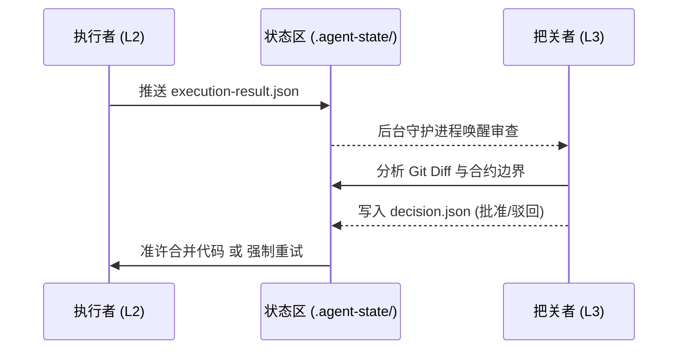

# L2/L3 双轨防线

为了防止 AI 产生盲从幻觉（自己写出错误代码并自己批准），我们在数学层面上隔离了执行者与审查者。

```mermaid
sequenceDiagram
    participant Executor as 执行者 (L2)
    participant State as 状态区 (.agent-state/)
    participant Gatekeeper as 把关者 (L3)

    Executor->>State: 推送 execution-result.json
    State-->>Gatekeeper: 后台守护进程唤醒审查
    Gatekeeper->>State: 分析 Git Diff 与合约边界
    Gatekeeper-->>State: 写入 decision.json (批准/驳回)
    State->>Executor: 准许合并代码 或 强制重试
```

> **警告:** 把关者是一个完全隔离的独立子进程，绝对无法被执行者绕过。
