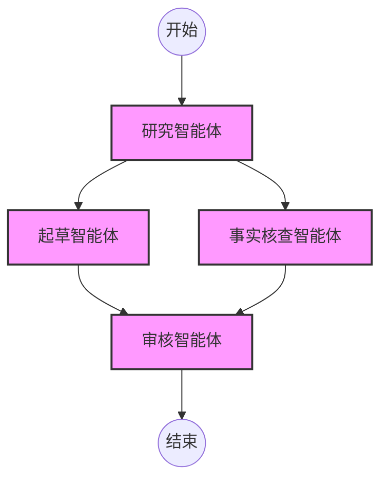

# YAML DAG 引擎 (YAML DAG Engine)

在团队模式 (Team Mode) 下，L3 编排器依赖 **YAML DAG 引擎** 来管理执行流程。有向无环图 (DAG) 为复杂的任务执行提供了一种确定性、透明且严格排序的结构。

## 为什么使用 YAML？

我们选择 YAML 来编写工作流是因为它：
1. **声明式**: 关注“做什么”，而不是“怎么做”。
2. **人类可读**: 非工程师、领域专家和提示词工程师也能轻松理解。
3. **机器可解析**: 易于与我们的 L1 执行协议和状态管理集成。

## DAG 的核心组件

一个标准的工作流包含三个主要模块：

1. **全局上下文 (Global Context)**: 定义共享状态、初始输入和总体目标。
2. **节点 (Nodes)**: 代表分配给特定任务的 L2 智能体。
3. **边 (Dependencies/Edges)**: 定义执行流程和节点之间的数据注入关系。



## Schema 概览

DAG 中的每个节点都必须遵守驾驭工程 (L4) 规范。

```yaml
version: "1.0"
name: "Article Generation Pipeline"

global_context:
  topic: "Quantum Computing Advances 2026"

nodes:
  - id: researcher
    agent_profile: "L2_DeepSearch"
    task: "收集关于 ${topic} 的前 5 项最新突破。"
    tools: ["search_api", "read_url"]
    
  - id: drafter
    agent_profile: "L2_TechnicalWriter"
    depends_on: ["researcher"]
    task: "使用研究员的数据撰写一篇 500 字的摘要。"
    inject_context:
      - source_node: "researcher"
        target_variable: "research_data"
        
  - id: reviewer
    agent_profile: "L2_Critic"
    depends_on: ["drafter"]
    task: "审查草稿的技术准确性。"
    inject_context:
      - source_node: "drafter"
        target_variable: "draft_text"

output: "reviewer.final_output"
```

## 执行语义

- **并行性**: 如果节点没有相交的 `depends_on` 依赖关系，L3 引擎会并发执行它们。
- **数据注入**: `inject_context` 块将已完成节点的输出映射到下游节点的提示词上下文中。
- **故障处理**: 如果节点失败（例如，L0 API 超时），引擎会根据节点的配置自动重试，然后再将图标记为失败。