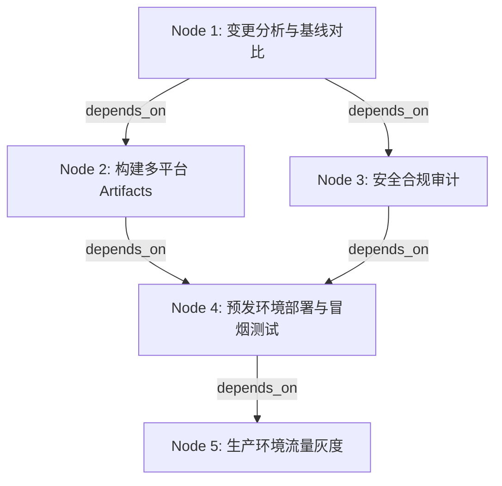

# 自定义工作流编写指南 (Authoring Custom Workflows)

本指南旨在深入解析如何在多智能体协作环境中设计、编写并应用自定义工作流 (Custom Workflows)。

## 1. 边界判定 (Boundary Decision)
系统已内置 18 种标准工作流（覆盖常规的代码生成、代码审查、基础测试等）。在以下场景中，建议跨越内置工作流的边界，转而设计**自定义工作流**：
- **复杂的多级依赖与并行 (Complex DAGs)**: 当任务存在深度超过 3 级的前置依赖，或需要执行大规模的 "Fan-out/Fan-in"（如并发多平台构建后统一汇总）时。
- **非标准角色的介入**: 流程中需要特殊的自定义智能体角色（如特定领域的架构评审专家、安全审计专家），或需要人类介入审批 (Human-in-the-loop)。
- **特殊的委派模式**: 需要在同一个工作流中混合使用全权委托 (`blackbox`) 和编排协作 (`orchestrated`) 模式以精细化控制执行时。
- **异构系统集成**: 强依赖于外部或遗留系统状态（如等待特定的 CI/CD webhook 回调、物理设备就绪信号等）。

## 2. 设计方法 (How to Design)
自定义工作流基于 YAML 语法构建。核心结构围绕有向无环图 (DAG) 展开：

### 核心属性解析
- `nodes`: 工作流的执行节点集合。每个节点代表一个由特定智能体执行的任务。
- `depends_on`: 节点级数组，声明当前节点的前置节点 ID。用于构建执行图谱。
- `task_spec`: 任务的详细规约。包含 `instruction` (指令), `context_files` (上下文路径), `expected_output` (期望输出格式)。
- `delegation_mode` (委派模式):
  - `blackbox` (黑盒模式): 父工作流/智能体仅下发任务并等待最终结果，不感知子任务执行细节。适用于边界清晰、高度内聚的任务（如纯前端组件转译）。
  - `orchestrated` (编排模式): 父智能体与执行节点保持状态同步，可随时介入、修正或中止子步骤。适用于开放性高、需多步探索的任务（如复杂 Bug 的排查与修复）。

## 3. 应用落库 (Application & Injection)
设计完成的工作流需落库注册后方可投入项目实战：

1. **落库路径**: 将 YAML 文件统一存放在项目根目录下的 `.agent-state/workflows/` 目录中。例如：`.agent-state/workflows/release_deploy.yaml`。
2. **触发机制**:
   - **CLI 手动触发**: `agent-cli run --workflow release_deploy`
   - **事件驱动 (Event-driven)**: 在项目的 `.agent-state/config.yaml` 中绑定触发器：
     ```yaml
     triggers:
       - event: github.pr.merged
         condition: "labels.includes('release')"
         workflow: release_deploy
     ```

## 4. 实战范例：自定义发布与部署流程 (Example: Custom Release & Deploy Flow)

### 流程图谱 (Mermaid)


### YAML 配置示例
```yaml
name: Custom-Release-and-Deploy
version: 1.0.0
description: "跨平台构建、安全审计并最终灰度发布的复杂工作流"

nodes:
  - id: analyze_changes
    agent: system_analyst
    delegation_mode: orchestrated
    task_spec:
      instruction: "分析 HEAD 与上一 tag 的差异，生成变更日志。"
      expected_output: "CHANGELOG.md"

  - id: build_artifacts
    agent: build_engineer
    depends_on: [analyze_changes]
    delegation_mode: blackbox
    task_spec:
      instruction: "根据变更拉取对应环境依赖，并行构建多平台包。"

  - id: security_audit
    agent: security_expert
    depends_on: [analyze_changes]
    delegation_mode: blackbox
    task_spec:
      instruction: "扫描变更代码的漏洞，输出 SAST 安全报告。"

  - id: staging_deploy_and_test
    agent: qa_automation
    depends_on: [build_artifacts, security_audit]
    delegation_mode: orchestrated
    task_spec:
      instruction: "将构建包部署至 Staging 环境并运行端到端冒烟测试。"

  - id: production_canary
    agent: release_manager
    depends_on: [staging_deploy_and_test]
    delegation_mode: orchestrated
    task_spec:
      instruction: "执行 10% 的生产环境灰度发布，并监控 15 分钟内的异常错误率。"
```